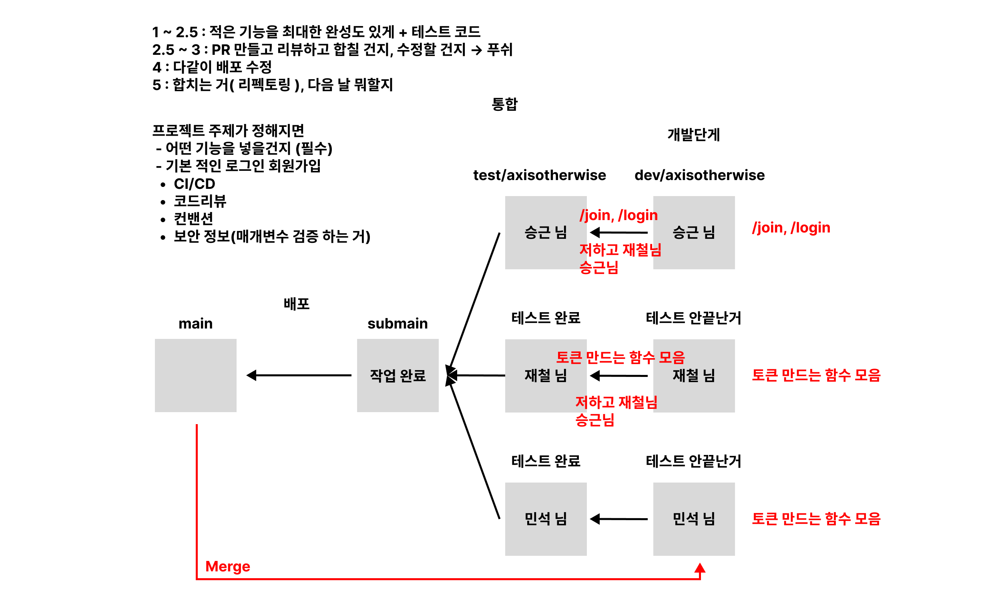

# Broccoli Velog Server

- 환경 변수 리스트 `ENV.md`
    - [> 로컬](./docs/ENV.md)
    - [> 브라우저](https://github.com/Broccoli-Velog/Broccoli-Backend/blob/main/docs/ENV.md)
- 작업 브런치 리스트 `BRANCHES.md`
    - [> 로컬](./docs/BRANCHES.md)
    - [> 브라우저](https://github.com/Broccoli-Velog/Broccoli-Backend/blob/main/docs/BRANCHES.md)